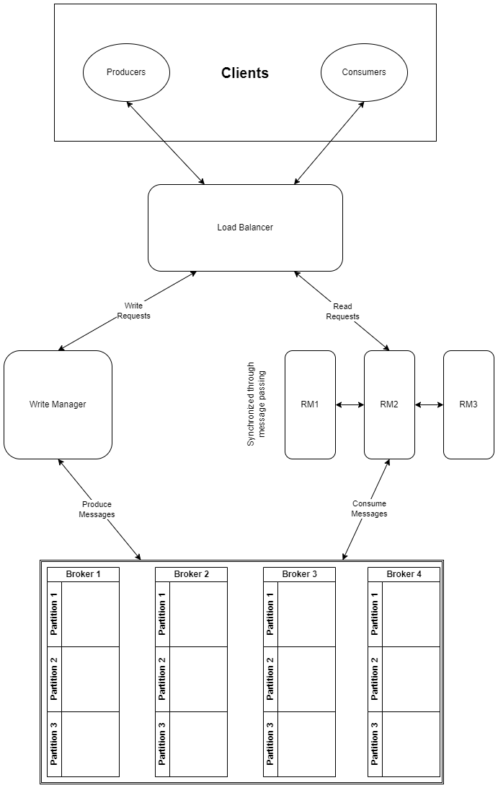

# DS-Connectify

Implementation of a distributed queue system.

Authors:\
Mayank Kumar (19CS30029)\
Ishan Goel (19CS30052)\
Shrinivas Khiste (19CS30043)\
Yashica Patodia (19CS10067)\
Shashwat Shukla (19CS10056)

## System Architecture

## How To Run
- Start the Load Balancer server \
`python load_balancer_app.py`
- Start the Write Manager server \
`python write_manager_app.py`
- Start 2 Read Managers\
`python read_manager_app.py -c configs/rm1.yaml`\
`python read_manager_app.py -c configs/rm2.yaml`
- Start 2 brokers\
`python broker_app.py -c configs/broker1.yaml`\
`python broker_app.py -c configs/broker2.yaml`
- Use Postman to request the Load Balancer at the different end points as per the report. 
